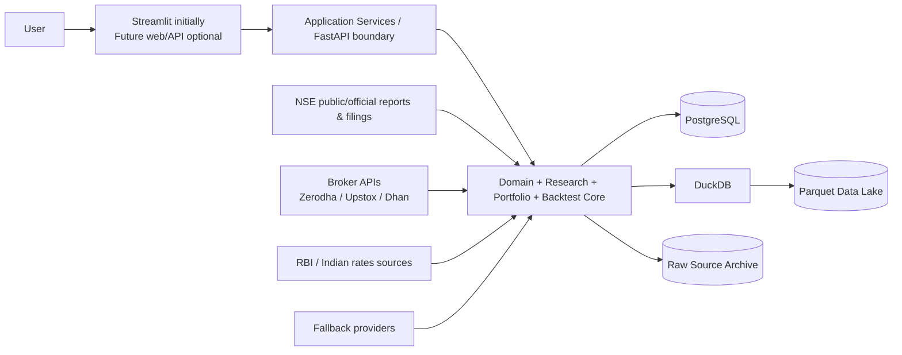
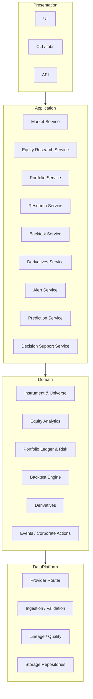
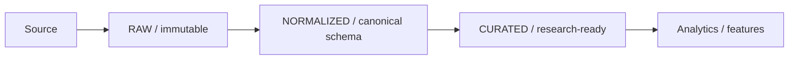
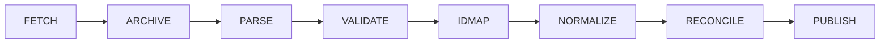
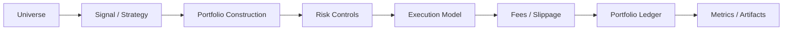

# Indian Market Platform — Target Architecture

> **Status:** Architecture specification / target state  
> **Primary market:** India (NSE-first; extensible to BSE and other venues)  
> **Primary user:** Private/personal research and portfolio use  
> **Current codebase:** `Bhargavvxx/options-analytics-suite`  
> **Baseline reviewed:** `main` @ `92fc3312258536f5394d6394245dd1b9dfc20c39`  
> **Revision:** Final integrated architecture including production prediction, forecast evaluation, opportunity ranking, and explainable decision support.  
> **Architecture principle:** equities and market intelligence are the core; derivatives are a specialized layer; predictions are probabilistic and auditable; suggestions are explainable attention-management outputs; execution is optional and isolated.

---

## 1. Executive decision

The current project should **not** evolve by adding a “Stocks” page to an options application. That would preserve the wrong center of gravity and create a permanently option-centric domain model.

The target system is an **India-first market research, portfolio intelligence, systematic research, and derivatives analytics platform** that is useful in daily personal workflows.

The system should help answer five classes of questions:

1. **Market:** What is happening across Indian equities, indices, sectors, breadth, liquidity, delivery, flows, volatility, and derivatives?
2. **Company:** What changed in a company’s price, fundamentals, ownership, corporate filings, valuation, peer position, and risk?
3. **Portfolio:** What do I own, what drove P&L, where am I concentrated, and what risks or events need attention?
4. **Research:** Which securities meet an explicit screen, what evidence supports a thesis, and what changed since I last reviewed it?
5. **Systematic:** Does an investment/trading rule survive a point-in-time, cost-aware, bias-controlled backtest?
6. **Decision support:** What deserves my attention now, what is the model forecasting, how uncertain is it, and what evidence supports or contradicts the signal?

Options remain important, but they become one source of information about an underlying and one tradable instrument family—not the root of the application.

---

# 2. Product boundaries

## 2.1 In scope

### Core
- NSE equities and indices.
- NSE equity derivatives (futures/options) as an integrated subsystem.
- Daily market and company research.
- Watchlists, research notes, theses, events, and alerts.
- Personal portfolio ledger, valuation, attribution, exposures, risk, and benchmark comparison.
- Point-in-time historical research and backtesting.
- Exchange/broker/provider abstraction.
- Provenance, raw-data preservation, quality checks, dataset versions, and reproducibility.
- Probabilistic forecasting with permanent prediction history, calibration, evaluation, and abstention when evidence is weak.
- Explainable opportunity/attention suggestions that state why an item surfaced and what argues against it.
- Optional local AI research assistant that answers only from retrieved evidence.

### Later, but architecturally supported
- BSE equities.
- ETFs, REITs/InvITs, mutual-fund references.
- Intraday selected-universe analytics.
- Paper trading.
- Read-only broker sync.
- Guarded broker execution.

## 2.2 Explicitly not a goal in the early system

- HFT or latency-sensitive execution.
- A TradingView clone.
- A fully automatic “buy/sell stock picker.”
- A single opaque stock score.
- Tick storage for every NSE instrument.
- Microservices/Kafka/Kubernetes.
- Prediction-first ML development before data correctness.
- Public redistribution of licensed exchange data without appropriate rights.

---

# 3. Design principles

## P1 — Canonical identity before analytics
Every instrument gets an internal, stable `instrument_id`. Provider or exchange tokens are aliases, not identity.

Why this is mandatory:
- Zerodha documents that derivative `instrument_token` values are flushed/reused across expiries and recommends storing the daily instrument dump.
- Upstox also warns that exchange tokens may be reused and recommends its stable `instrument_key`.

The platform therefore owns an identity layer independent of any broker.

## P2 — Point-in-time correctness over convenient current-state tables
Historical analysis must reconstruct what was **known at time T**, not what the database knows today.

Every information class that can be revised or published later should carry appropriate timestamps such as:
- `effective_at`
- `period_end`
- `published_at`
- `revision_at`
- `retrieved_at`
- `valid_from`
- `valid_to`

## P3 — Raw is immutable
Provider/exchange payloads are preserved before normalization. Never make the transformed table the only copy.

## P4 — Provenance is part of the data model
Every material fact must be traceable to its source and ingestion run.

## P5 — Provider capabilities, not one giant provider interface
“Market data provider” is too broad. Reference data, historical bars, corporate filings, fundamentals, derivatives, rates, and broker holdings have different semantics and availability.

## P6 — Research is read-mostly; execution is isolated
Research failures must never directly become live orders. Execution is an adapter behind an explicit safety boundary.

## P7 — Explainable analysis before composite scoring
Expose dimensions and evidence. Avoid a magic “83/100 BUY” score.

## P8 — Reproducibility is a product feature
Every backtest, screen, model, and research snapshot should be reproducible from a dataset version + config + code version.

## P9 — Modular monolith first
One Python codebase with strong packages and interfaces is preferable to operationally expensive distributed architecture for a personal system.

## P10 — India-native defaults
INR, IST, NSE calendars, Indian corporate actions, Indian fee/tax schedules, Indian rates, NSE instruments, and Indian settlement conventions are default—not patches over US assumptions.

## P11 — Forecasts are probabilistic claims with a scorecard
Every production prediction must declare its horizon, target, model/version, input-data cutoff, probability or uncertainty interval, confidence/coverage state, and later outcome evaluation. A forecast that cannot be evaluated later should not be presented as a serious model output.

## P12 — Suggestions manage attention; they do not replace judgment
The system may surface `MONITOR`, `RESEARCH`, `HIGH_INTEREST`, `REVIEW`, or `RISK_WARNING` states, but every suggestion must expose supporting evidence, conflicting evidence, freshness, and the rule/model that caused it to appear. No opaque universal stock score or automatic buy/sell verdict.

---

# 4. What survives from the current repository

The current project already has useful design discipline. Preserve it.

## 4.1 Keep and migrate

| Current component | Decision | Target location / role |
|---|---|---|
| `analytics/pricing.py` | Keep | `derivatives/options/pricing.py` |
| `analytics/greeks.py` | Keep | `derivatives/options/greeks.py` |
| `analytics/implied_vol.py` | Keep after validation fixes | `derivatives/options/implied_vol.py` |
| `analytics/volatility.py` | Keep, generalize | `analytics/volatility.py` or `market/volatility.py` |
| `analytics/iv_surface.py` | Keep after real-chain integration | `derivatives/options/surface.py` |
| `analytics/smile.py` | Keep, harden | `derivatives/options/svi.py` |
| `analytics/arbitrage.py` | Keep, correct math | `derivatives/options/arbitrage.py` |
| `analytics/american.py` | Retain as non-core educational/model module | `derivatives/options/models/american.py` |
| `risk/` | Keep concepts, redesign domain model | `portfolio/risk/` |
| `strategies/definitions.py` | Keep concept | derivatives strategy catalog |
| `config/errors.py` | Keep | core exceptions |
| thin `run.py`/UI separation | Keep principle | UI calls services only |
| tests around pricing/Greeks/IV | Keep | regression suite |

## 4.2 Replace or redesign

| Current component | Problem | Replacement |
|---|---|---|
| `MarketDataProvider` | Too broad and US/Yahoo-centric | capability-based providers |
| `BacktestEngine` | option-specific, incorrect NAV/fills/expiry lifecycle | generic event/portfolio backtester |
| current portfolio model | effectively single-underlying and multiplier pitfalls | multi-instrument ledger + market-state valuation |
| `Settings()` globals | duplicated defaults and environment overrides not consistently used | one injected application settings object |
| US Treasury ticker mapping | wrong market | Indian rate provider + fallback config |
| current ML tab | leakage/model-selection/persistence issues; low priority | later research pipeline |
| generic sentiment | low signal | event/filing evidence pipeline later |

---

# 5. System context



The application is intentionally a **modular monolith**. Storage is separated by workload, not by fashionable technology.

---

# 6. Logical architecture



Dependency direction matters:

`UI -> application services -> domain -> repository/provider interfaces`

Provider SDKs, Streamlit, and database drivers should **not** leak into pricing, portfolio, or strategy logic.

---

# 7. Proposed repository structure

```text
src/
├── core/
│   ├── identifiers.py
│   ├── money.py
│   ├── time.py
│   ├── enums.py
│   ├── errors.py
│   └── settings.py
│
├── instruments/
│   ├── models.py
│   ├── service.py
│   ├── aliases.py
│   ├── calendars.py
│   └── universes.py
│
├── providers/
│   ├── contracts/
│   │   ├── reference.py
│   │   ├── prices.py
│   │   ├── live.py
│   │   ├── corporate.py
│   │   ├── fundamentals.py
│   │   ├── derivatives.py
│   │   ├── rates.py
│   │   └── broker.py
│   ├── router.py
│   ├── nse/
│   ├── zerodha/
│   ├── upstox/
│   ├── dhan/
│   └── yahoo/
│
├── ingestion/
│   ├── jobs/
│   ├── parsers/
│   ├── normalization/
│   ├── reconciliation/
│   ├── quality/
│   ├── lineage/
│   └── manifests.py
│
├── storage/
│   ├── postgres/
│   ├── parquet/
│   ├── duckdb/
│   └── raw_archive/
│
├── market/
│   ├── breadth.py
│   ├── sectors.py
│   ├── liquidity.py
│   ├── delivery.py
│   ├── flows.py
│   ├── relative_strength.py
│   └── volatility.py
│
├── equity/
│   ├── prices.py
│   ├── fundamentals.py
│   ├── valuation.py
│   ├── quality.py
│   ├── growth.py
│   ├── ownership.py
│   ├── peers.py
│   ├── screener.py
│   └── events.py
│
├── derivatives/
│   ├── futures/
│   │   ├── contracts.py
│   │   ├── curves.py
│   │   ├── basis.py
│   │   └── rollover.py
│   └── options/
│       ├── contracts.py
│       ├── pricing.py
│       ├── greeks.py
│       ├── implied_vol.py
│       ├── volatility.py
│       ├── surface.py
│       ├── svi.py
│       ├── arbitrage.py
│       └── strategies.py
│
├── portfolio/
│   ├── ledger.py
│   ├── positions.py
│   ├── valuation.py
│   ├── performance.py
│   ├── attribution.py
│   ├── exposures.py
│   ├── risk.py
│   └── reconciliation.py
│
├── backtest/
│   ├── engine.py
│   ├── events.py
│   ├── universe.py
│   ├── strategy.py
│   ├── portfolio.py
│   ├── execution.py
│   ├── fees_india.py
│   ├── slippage.py
│   ├── corporate_actions.py
│   ├── metrics.py
│   └── artifacts.py
│
├── research/
│   ├── watchlists.py
│   ├── notes.py
│   ├── thesis.py
│   ├── snapshots.py
│   └── comparisons.py
│
├── alerts/
│   ├── rules.py
│   ├── evaluator.py
│   └── delivery.py
│
├── prediction/               # later, after PIT backtesting + ML research
│   ├── definitions.py
│   ├── features.py
│   ├── inference.py
│   ├── calibration.py
│   ├── registry.py
│   ├── ledger.py
│   └── evaluation.py
│
├── decision_support/
│   ├── opportunities.py
│   ├── attention.py
│   ├── explanations.py
│   ├── conflicts.py
│   └── daily_brief.py
│
├── ai/                       # later phase
│   ├── retrieval.py
│   ├── evidence.py
│   └── assistant.py
│
├── application/
│   ├── market_service.py
│   ├── equity_service.py
│   ├── portfolio_service.py
│   ├── backtest_service.py
│   ├── research_service.py
│   ├── prediction_service.py
│   └── decision_support_service.py
│
├── api/
├── ui/
└── jobs/

tests/
├── unit/
├── integration/
├── invariants/
├── replay/
├── data_contracts/
└── fixtures/
```

Do **not** create all packages at once. This is a target map. The implementation plan defines when each is justified.

---

# 8. Canonical instrument model

## 8.1 Why an internal identifier is necessary

A symbol is not a permanent identity:
- names change;
- symbols change;
- securities merge/delist/relist;
- derivatives expire;
- broker/exchange numerical tokens can be reused.

Create immutable internal identifiers such as UUID/ULID.

## 8.2 `instrument`

Suggested fields:

```text
instrument_id            UUID / ULID PK
instrument_type          EQUITY | INDEX | ETF | FUTURE | OPTION | ...
primary_exchange         NSE | BSE | ...
currency                 INR
isin                     nullable
company_id               nullable
underlying_instrument_id nullable FK -> instrument
active_from               date/timestamp
active_to                 nullable
status                    ACTIVE | EXPIRED | DELISTED | SUSPENDED | ...
metadata_version          integer
created_at
updated_at
```

## 8.3 `instrument_alias`

```text
alias_id
instrument_id
provider                  NSE | ZERODHA | UPSTOX | DHAN | YAHOO | ...
alias_type                SYMBOL | EXCHANGE_TOKEN | INSTRUMENT_TOKEN | INSTRUMENT_KEY | SECURITY_ID
alias_value
valid_from
valid_to
source_ingestion_run_id
```

**Invariant:** aliases may change; `instrument_id` does not.

## 8.4 Derivative contract extension

```text
derivative_contract
- instrument_id
- underlying_instrument_id
- segment
- expiry
- lot_size
- tick_size
- settlement_type
- exercise_style
- contract_multiplier
- strike                nullable for futures
- option_type           nullable for futures
- contract_spec_version
```

Never assume lot size forever. NSE publishes current contract files and lot sizes can change.

---

# 9. Company, security, and index are different concepts

Avoid collapsing “company”, “equity instrument”, and “ticker” into one object.

```text
Company
  1 ---- N Equity Instruments

Index
  1 ---- N IndexMembership ---- N Instruments
```

## `company`

```text
company_id
legal_name
cin                nullable
sector_id
industry_id
website             nullable
status
```

## `index`

```text
index_id
instrument_id       optional market instrument representation
provider
name
family
methodology_version
```

## `index_membership`

```text
index_id
instrument_id
valid_from
valid_to
weight              nullable
source
retrieved_at
```

This dated membership table is essential to avoid survivorship bias.

---

# 10. Time and calendar model

## 10.1 Timezone policy

- Store instants in timezone-aware UTC.
- Preserve source timezone where useful.
- Present Indian market time as `Asia/Kolkata`.
- Never use naive `datetime.utcnow()` as a canonical stored timestamp.

## 10.2 Trading calendar

Maintain an exchange calendar table:

```text
exchange_session
- exchange
- trade_date
- session_type
- preopen_start
- regular_open
- regular_close
- special_session
- source
```

The NSE publishes market timings and annual holidays; the calendar should be ingested/versioned instead of manually hard-coded.

## 10.3 Point-in-time timestamp vocabulary

Use explicit semantics:

| Field | Meaning |
|---|---|
| `event_time` | when the market/company event occurred |
| `period_end` | accounting/reporting period |
| `published_at` | when information became public |
| `effective_at` | when a rule/action became economically effective |
| `retrieved_at` | when our system fetched it |
| `revision_at` | when source revised it |
| `valid_from/to` | validity interval for reference data |

Backtesting must use `published_at`, not merely `period_end`.

---

# 11. Storage architecture

Use three principal storage forms, each for a different workload.

## 11.1 PostgreSQL — authoritative relational state

Store:
- instrument master and aliases;
- companies/sectors/industries;
- index memberships;
- corporate actions/events metadata;
- filing metadata;
- normalized fundamental facts;
- shareholding snapshots;
- watchlists;
- research notes/theses;
- portfolio ledger/trades;
- alert rules;
- forecast definitions and model deployment metadata;
- prediction ledger and matured-outcome evaluations;
- opportunity/attention snapshots and explanation payloads;
- provider/source registry;
- ingestion runs;
- data-quality results;
- backtest metadata and run manifests.

## 11.2 Parquet — analytical time-series history

Store large append-oriented datasets:
- daily bars;
- selected intraday bars;
- delivery history;
- option-chain snapshots;
- futures snapshots;
- derived factor/features tables;
- prediction outputs/evaluation panels when large enough for analytical storage;
- benchmark/index histories.

Recommended partition examples:

```text
data/parquet/daily_bars/exchange=NSE/year=2026/...
data/parquet/option_snapshots/underlying=NIFTY/date=2026-09-21/...
```

Avoid excessive tiny files; compact periodically.

## 11.3 DuckDB — local analytical query engine

DuckDB reads Parquet directly and is ideal for:
- screens;
- research notebooks;
- cross-sectional calculations;
- backtest dataset assembly;
- ad hoc comparisons.

Do not introduce a distributed warehouse for a personal system unless evidence later demands it.

## 11.4 Raw source archive

Preserve source payloads under deterministic paths:

```text
raw/{provider}/{dataset}/{YYYY}/{MM}/{DD}/{ingestion_run_id}/...
```

Attach:
- SHA-256;
- request/source metadata;
- content type;
- retrieval timestamp;
- parser version.

---

# 12. Data zones



## RAW
Exact or minimally wrapped source data.

## NORMALIZED
Provider fields mapped to internal models and canonical IDs.

## CURATED
Clean, reconciled, corporate-action-aware, quality-approved datasets.

## ANALYTICS
Derived values such as:
- returns;
- momentum;
- relative strength;
- volatility;
- valuation ratios;
- factor exposures;
- breadth;
- screens.

Derived data must not overwrite source facts.

---

# 13. Provider architecture

## 13.1 Capability interfaces

Do not use one `MarketDataProvider` ABC. Use narrow protocols/interfaces.

```python
class ReferenceDataProvider(Protocol): ...
class HistoricalPriceProvider(Protocol): ...
class LiveQuoteProvider(Protocol): ...
class CorporateEventsProvider(Protocol): ...
class FundamentalsProvider(Protocol): ...
class DerivativesProvider(Protocol): ...
class RatesProvider(Protocol): ...
class BrokerPortfolioProvider(Protocol): ...
class ExecutionProvider(Protocol): ...
```

A provider declares capabilities.

## 13.2 Standard query/result envelope

Borrow the useful idea from OpenBB: normalize query and response schemas across providers.

Every result envelope should carry:

```text
provider
source_dataset
retrieved_at
as_of
is_delayed
quality_flags
raw_artifact_id
warnings
results
```

## 13.3 Provider router

The router selects by:
1. requested capability;
2. configured priority;
3. data rights/availability;
4. freshness requirement;
5. provider health;
6. fallback rules.

Fallback must be explicit and visible. A Yahoo fallback should never silently masquerade as an NSE official record.

---

# 14. India-first source strategy

This is a **source preference**, not a guarantee that every endpoint may be scraped or redistributed. Terms/licensing must be respected.

## 14.1 Official NSE reporting layer

NSE currently publishes/report-surfaces useful datasets including:
- CM UDiFF Common Bhavcopy;
- security-wise delivery positions;
- short-selling reports;
- market activity;
- F&O UDiFF Common Bhavcopy;
- participant-wise OI and trading volume;
- FII derivative statistics;
- contract/settlement-related files;
- corporate announcements;
- financial results;
- corporate actions;
- shareholding patterns.

These should be modeled as named datasets and ingested with manifests.

## 14.2 Broker APIs

Useful for:
- historical candles;
- live/near-live quotes;
- option/futures instrument masters;
- account/position data;
- later paper/live order adapters.

Current examples:
- Zerodha documents daily instrument dumps, historical candles, and derivative-token lifecycle constraints.
- Upstox V3 documents daily history back to 2000 and minute history from 2022 for supported instruments.
- Dhan documents daily history back to instrument inception and intraday history with bounded retrieval windows.

Never promise availability beyond provider documentation; availability can change.

## 14.3 Rates

Use an Indian `RatesProvider` rather than US Treasury symbols.

Potential source classes:
- RBI policy/rate data;
- Indian money-market benchmark sources where permitted;
- configured manual/market curve for research reproducibility.

Store the curve actually used by each derivative calculation/backtest.

## 14.4 Data licensing

NSE explicitly maintains a data sharing/usage policy and paid real-time/historical/corporate products. The architecture must therefore store:

```text
source_id
usage_scope
license_notes
redistribution_allowed
retention_notes
```

Private research and public redistribution are different use cases.

---

# 15. Ingestion architecture

Every ingestion is a job with an immutable run record.

```text
ingestion_run
- run_id
- provider
- dataset
- started_at
- finished_at
- status
- request_parameters
- raw_artifact_count
- normalized_row_count
- rejected_row_count
- parser_version
- code_commit
- error_summary
```

## Pipeline



### Fetch
Acquire source payload.

### Archive
Persist bytes + hash before parsing.

### Parse
Provider-specific parser.

### Validate
Schema + semantic checks.

### ID map
Resolve provider symbols/tokens into canonical instruments.

### Normalize
Map to canonical units/names/types.

### Reconcile
Compare against another source when appropriate.

### Publish
Mark curated dataset partition/version as usable.

No partially failed ingestion should silently become “latest good data.”

---

# 16. Data quality framework

A serious-use system needs explicit quality status.

## 16.1 Quality checks

### Schema
- required fields;
- types;
- duplicate natural keys;
- null constraints;
- timezone awareness.

### Market invariants
- `low <= open/close <= high` where applicable;
- non-negative volume;
- positive prices;
- bid <= ask;
- derivative expiry after listing;
- lot/tick sizes positive;
- no duplicate canonical instrument + timestamp rows.

### Cross-source checks
Examples:
- official EOD close vs broker daily close;
- corporate-action dates across sources;
- index membership consistency.

### Freshness
Each dataset has an expected SLA/frequency.

## 16.2 Quality result

```text
data_quality_check
- run_id
- dataset_version
- rule_id
- severity
- passed
- affected_rows
- sample_evidence
```

Severities:
- INFO
- WARN
- BLOCK

BLOCK means the partition is not promoted to curated state.

---

# 17. Corporate-action engine

This is mandatory for equity analytics and backtests.

Support events such as:
- cash dividends;
- stock splits;
- bonuses;
- rights;
- mergers/demergers;
- symbol changes;
- delisting/suspension lifecycle.

Keep raw and adjusted representations separate.

## 17.1 Price views

Expose explicit modes:

```text
RAW
SPLIT_ADJUSTED
TOTAL_RETURN_ADJUSTED
```

Never hide adjustment mode.

## 17.2 Backtest event handling

Corporate actions should enter the event stream. They should not be pre-baked invisibly into accounting when the simulation needs economic cash/share effects.

---

# 18. Equity analytics architecture

The stock workspace becomes a first-class aggregate built from several services.

## 18.1 Price/market behavior
- returns across horizons;
- drawdowns;
- rolling volatility;
- ATR/range metrics;
- liquidity / average traded value;
- volume anomalies;
- delivery metrics;
- 52-week context;
- relative strength vs benchmark and sector.

## 18.2 Fundamentals
Normalize facts rather than only storing ratios.

```text
fundamental_fact
- company_id
- statement_type
- scope                  consolidated | standalone
- period_type            quarterly | annual | TTM
- period_end
- metric_code
- value
- currency
- unit
- published_at
- revision_at
- source_filing_id
```

Ratios are derived in a separate layer so formula versions are auditable.

## 18.3 Ownership

NSE shareholding disclosures include as-on, submission, and revision dates. Preserve them.

```text
shareholding_snapshot
- company_id
- as_of_date
- submitted_at
- revised_at
- promoter_pct
- public_pct
- fii_or_fpi_pct         where derivable/available
- institutional_pct      where derivable/available
- source_filing_id
```

Do not fabricate categories not present in source structure.

## 18.4 Valuation
Store formula/version metadata for:
- P/E;
- P/B;
- EV/EBITDA;
- earnings yield;
- FCF yield where meaningful;
- sector-relative percentile;
- own-history percentile.

A ratio must expose numerator, denominator, periods, and formula version.

## 18.5 Peer comparison
Peer groups should be explicit:
- industry taxonomy;
- index cohort;
- custom user group.

Avoid automatic “peer” claims with no basis.

---

# 19. Screening architecture

Screens are expressions over **versioned data as of a date**.

Example:

```text
ROCE_TTM > 0.15
AND debt_to_equity < 0.5
AND sales_cagr_3y > 0.10
AND close > sma_200
AND avg_traded_value_20d > X
```

A saved screen stores:
- expression/AST;
- universe;
- as-of policy;
- missing-data policy;
- metric formula versions;
- creation/update timestamps.

## Avoid magic composite ratings
If dimensions are shown, each must be inspectable:
- quality;
- growth;
- valuation;
- momentum;
- liquidity;
- risk.

The system may rank a screen by a user-selected numeric metric, but it should not pretend that an opaque composite is an investment recommendation.

---

# 20. Market intelligence layer

## 20.1 Daily dashboard datasets

- NIFTY/index performance;
- market breadth;
- 52-week highs/lows;
- sector performance;
- volume and liquidity anomalies;
- delivery anomalies;
- India VIX;
- F&O market activity/OI datasets;
- corporate results/events calendar;
- watchlist and portfolio changes.

India VIX is based on NIFTY option prices and expresses expected near-term volatility; treat it as a market-state input rather than a directional signal.

## 20.2 Historical breadth requires historical universe
Breadth for an index/date must use constituents valid on that date, not today’s constituents.

---

# 21. Research workspace

The most useful personal feature is persistent research state.

## `research_note`

```text
note_id
instrument_id
created_at
updated_at
as_of_market_date
title
body_markdown
tags
```

## `thesis`

```text
thesis_id
instrument_id
status              IDEA | ACTIVE | INVALIDATED | CLOSED
summary
catalysts
risks
invalidation_conditions
created_at
review_due_at
closed_at
```

## `research_snapshot`
A snapshot freezes:
- relevant metrics;
- source versions;
- current thesis;
- market date;
- attachments/filings references.

This lets you later ask, “What did I believe then, and what changed?”

---

# 22. Watchlists and alerts

## Watchlists
Named, purposeful collections:
- research queue;
- earnings watch;
- high-quality candidates;
- portfolio candidates;
- derivatives watch;
- custom themes.

## Alert rule model

```text
alert_rule
- rule_id
- scope                instrument | watchlist | portfolio | market
- condition_ast
- evaluation_frequency
- cooldown
- enabled
```

Examples:
- price/technical threshold;
- unusual volume/delivery;
- new filing/announcement;
- financial result posted;
- shareholding revision;
- portfolio drawdown/concentration;
- IV/OI condition.

Alerts should link to evidence and the exact triggering values.

---

# 23. Portfolio architecture

A portfolio is a **ledger**, not a mutable “current positions” table.

## 23.1 Ledger events

```text
BUY
SELL
DIVIDEND
FEE
TAX
CASH_DEPOSIT
CASH_WITHDRAWAL
SPLIT
BONUS
RIGHTS
EXPIRY
EXERCISE
ASSIGNMENT
SETTLEMENT
ADJUSTMENT
```

Current positions are projections from the ledger.

## 23.2 Core invariant

At any valuation timestamp:

```text
NAV = cash + market_value(positions) + receivables - liabilities
```

This invariant must be tested.

## 23.3 Multi-instrument market state

Valuation accepts a map:

```text
instrument_id -> market price / curve / vol surface / FX if ever needed
```

Never one `S, r, q` shared by unrelated instruments.

## 23.4 Portfolio analytics

- holdings and cash;
- realised/unrealised P&L;
- income/dividends;
- time-weighted return;
- XIRR/money-weighted return where appropriate;
- benchmark-relative return;
- sector/industry exposure;
- single-name concentration;
- rolling volatility/beta;
- drawdown;
- contribution/attribution;
- derivatives Greeks where relevant.

---

# 24. Backtesting architecture 2.0

Adopt the good abstraction used by mature engines such as LEAN, without copying its operational complexity.



## 24.1 Components

### Universe selection
Returns valid instruments at date T using historical membership/listing state.

### Signal/strategy
Produces intentions or scores—not direct cash mutations.

### Portfolio construction
Transforms signals into target weights/quantities.

### Risk
Can clip/reject targets.

### Execution
Generates simulated orders/fills.

### Fees
Versioned India-specific schedules.

### Ledger/accounting
All economic effects become events.

### Metrics
Consume NAV/returns after accounting; never compute “equity” from cash alone.

## 24.2 Point-in-time guard

The data accessor must enforce:

```text
published_at <= simulation_time
```

for information-based strategies.

## 24.3 Execution realism levels

Explicit run modes:

1. `CLOSE_TO_CLOSE_RESEARCH`
2. `NEXT_OPEN`
3. `BAR_EXECUTION`
4. `QUOTE_BASED`
5. `OPTION_SNAPSHOT_REPLAY`

A report must state which mode was used.

## 24.4 India fee engine

Create a versioned fee schedule capable of modeling:
- brokerage;
- exchange transaction charges;
- statutory taxes/levies;
- GST where applicable;
- stamp duty;
- segment and buy/sell-side differences.

Do not hard-code today’s rates into engine logic. Store effective dates and source.

---

# 25. Bias controls in research/backtesting

Mandatory controls:

- survivorship bias;
- look-ahead bias;
- publication delay;
- revised financial statements;
- corporate actions;
- delistings;
- stale/untradable instruments;
- liquidity constraints;
- benchmark membership changes;
- strategy parameter overfitting;
- train/validation/test contamination.

Every backtest artifact should include a “bias controls” section reporting which protections were active.

---

# 26. Derivatives architecture

Options no longer own the application. They consume the same instrument/data foundations.

## 26.1 Contracts
Use the derivative contract master rather than parsing symbol strings as truth.

## 26.2 Indian product rules
NSE’s current individual-security option documentation states that stock options are European style and physically settled. Product specifications can change, so exercise/settlement style must be **reference data with validity dates**, not an eternal constant in code.

## 26.3 Futures
Add:
- contract master;
- basis vs cash;
- cost-of-carry analysis;
- open interest;
- rollover/continuous-series construction;
- expiry lifecycle.

## 26.4 Options
Existing quant stack becomes a service over real contracts/quotes:

```text
contract + underlying + rates + dividends + market quote
 -> price / IV / Greeks / surface / strategy analytics
```

## 26.5 Surface accuracy
Future hardening requirements:
- q/dividend-aware forwards;
- log-forward-moneyness calendar checks;
- non-uniform strike convexity logic;
- calibration validity flags;
- never hide invalid SVI states by clipping without a warning.

---

# 27. Option-chain snapshot collector

Longitudinal option-chain history is valuable and not uniformly available from broker historical APIs.

Build an **append-only collector** for a deliberately limited universe.

Initial underlyings:
- NIFTY;
- BANKNIFTY or other selected index instruments if currently available/desired;
- user-selected F&O equities.

Snapshot fields:

```text
snapshot_at
underlying_instrument_id
option_instrument_id
expiry
strike
option_type
bid
ask
last
volume
open_interest
underlying_price
provider
quality_flags
```

Store raw snapshot payload and normalized Parquet.

Do not capture every contract every second. Start with a sustainable cadence and measure storage/usefulness.

---

# 28. ML architecture — deliberately later

ML should become a research workflow, not a UI gimmick.

## Required before serious ML
- clean historical universe;
- point-in-time features;
- correct labels;
- leakage-safe splitting;
- reproducible datasets;
- benchmark comparisons;
- realistic cost-aware portfolio evaluation.

## Experiment object

```text
experiment_id
feature_set_version
label_version
universe_version
dataset_cutoff
train_window
validation_window
test_window
purge_or_embargo
model_config
code_commit
artifacts
metrics
```

Use walk-forward or purged time-series validation where labels overlap future windows.

The current forward-vol target must not be allowed to leak across a train/test boundary.

ML research and production prediction are separate concerns: an experiment can be interesting without being approved to generate user-facing forecasts.

---

# 29. Prediction and forecasting architecture

## 29.1 Purpose

The prediction layer turns **approved, leakage-safe research models** into versioned probabilistic forecasts that can be monitored and evaluated over time.

It must not present certainty where none exists. The preferred product is a distribution, probability, interval, or regime state—not an unsupported exact price target.

## 29.2 Forecast families

Initial supported families should be deliberately small and independently validated:

```text
DIRECTION_PROBABILITY
- P(return > 0) over 5 / 20 / 60 trading sessions

RELATIVE_OUTPERFORMANCE
- P(stock return > NIFTY / sector return) over a defined horizon

RETURN_DISTRIBUTION
- expected return distribution / quantiles, not only a point estimate

VOLATILITY_FORECAST
- expected realised volatility over 5 / 20 / 60 sessions

DRAWDOWN_RISK
- P(drawdown worse than configured threshold over horizon)

MARKET_REGIME
- probability/state for trend, range, normal-vol, stressed/high-vol regimes
```

Not every instrument needs every forecast. Availability depends on training coverage, liquidity, history, and validation quality.

## 29.3 Forecast definition

```text
forecast_definition
- forecast_id
- target_name
- horizon_sessions
- universe_scope
- benchmark_id           nullable
- model_deployment_id
- feature_set_version
- label_version
- minimum_history
- minimum_quality_state
- abstention_policy
- calibration_version
- active_from
- active_to
```

## 29.4 Permanent prediction ledger

Every forecast shown to the user is immutable after issuance.

```text
prediction_record
- prediction_id
- forecast_id
- instrument_id
- prediction_as_of
- data_cutoff_at
- generated_at
- horizon_end_expected
- model_version
- data_version
- code_commit
- raw_output
- probability / quantiles / interval
- confidence_bucket
- calibration_state
- coverage_state
- quality_flags
- explanation_feature_refs
```

A later model version must create a new prediction; it must never rewrite history.

## 29.5 Outcome evaluation

When the horizon matures, create a separate record:

```text
prediction_evaluation
- prediction_id
- matured_at
- observed_outcome
- benchmark_outcome       nullable
- correctness / error
- brier_or_log_loss       where applicable
- absolute / quantile error where applicable
- regime_at_prediction
- sector_at_prediction
- evaluation_version
```

This enables the platform to answer:

- How well has this model actually performed?
- Does it work better in Financials than Smallcaps?
- Does high confidence really mean higher accuracy?
- Does performance deteriorate in stressed regimes?
- Has the model decayed since deployment?

## 29.6 Calibration and baselines

Production forecast reports must compare against simple baselines such as:
- unconditional historical frequency;
- market/sector direction frequency;
- simple momentum;
- historical mean/median;
- naive volatility persistence;
- buy-and-hold/benchmark where portfolio relevance is tested.

Classification/probability models should report calibration, not accuracy alone. Use appropriate metrics such as Brier score/log loss/calibration curves in addition to discrimination metrics.

Regression/distribution models should report appropriate out-of-sample error/quantile coverage, not only in-sample fit.

## 29.7 Confidence and abstention

The system must be able to output:

```text
NO_RELIABLE_SIGNAL
```

Reasons can include:
- model disagreement;
- low calibration quality;
- out-of-distribution features;
- stale/missing inputs;
- insufficient instrument history;
- confidence below configured threshold;
- prediction uncertainty too wide.

Coverage is a first-class metric. A model that abstains on 40% of cases must disclose that alongside accuracy on the remaining 60%.

## 29.8 Ensemble/conflict handling

Do not average incompatible models blindly.

Store each component forecast and expose disagreement. Example:

```text
Momentum model       positive
Fundamental model    neutral
Regime model         negative
Combined state       INCONCLUSIVE
```

The combination rule must be versioned and backtested like any other model.

## 29.9 No exact-price theatre

An exact future price can be displayed only if it is clearly derived from a forecast distribution/model and accompanied by uncertainty. The default UI should prefer ranges, quantiles, probabilities, and benchmark-relative forecasts.

---

# 30. Opportunity and decision-support architecture

## 30.1 Purpose

The decision-support layer converts **screens + forecasts + events + portfolio context + research state** into a prioritized list of things worth the user's attention.

It is not an automatic investment adviser and does not issue unconditional `BUY`/`SELL` verdicts.

## 30.2 Opportunity object

```text
opportunity_snapshot
- opportunity_id
- generated_at
- as_of
- instrument_id / portfolio_id / market scope
- opportunity_type
- attention_state
- research_lens
- supporting_evidence[]
- conflicting_evidence[]
- prediction_refs[]
- screen_refs[]
- event_refs[]
- portfolio_context_refs[]
- freshness_state
- confidence_state
- explanation_version
```

Suggested attention states:

```text
MONITOR
RESEARCH
HIGH_INTEREST
REVIEW
RISK_WARNING
NO_RELIABLE_SIGNAL
```

These are workflow states, not trade instructions.

## 30.3 Research lenses

A user may switch the evidence emphasis without changing the underlying facts:

### Long-term research
Emphasize:
- growth;
- profitability/quality;
- balance-sheet risk;
- cash flow;
- valuation context;
- ownership/filing changes.

### Swing/positional research
Emphasize:
- relative strength;
- momentum;
- volume/delivery;
- volatility;
- sector/market regime;
- event risk.

### Derivatives research
Emphasize:
- IV level/percentile where history exists;
- realised vs implied volatility;
- skew/term structure;
- liquidity/spread;
- OI/change in OI;
- event/expiry context.

A lens changes prioritization, not source truth.

## 30.4 “Why am I seeing this?” contract

Every surfaced opportunity must be inspectable.

Example structure:

```text
Why surfaced
✓ 6M relative strength vs NIFTY is high
✓ earnings trend improved
✓ sector momentum is positive

Against the idea
✗ valuation above own-history median
✗ major result event in 6 sessions

Forecasts
20D outperformance probability: 0.63
confidence: MEDIUM

Freshness
all critical inputs current as of <timestamp>
```

The explanation must reference actual stored metrics/events/prediction IDs rather than generated prose alone.

## 30.5 Daily attention brief

The platform should be able to generate a deterministic list such as:

```text
What should I look at today?
1. portfolio event/risk item
2. new material filing in watchlist
3. high-interest research candidate
4. unusual market/sector condition
5. derivatives/volatility anomaly
```

Selection should consider:
- materiality;
- user watchlists/research state;
- portfolio exposure;
- freshness;
- model confidence;
- novelty since last review;
- duplicate/cooldown rules.

## 30.6 Portfolio-aware suggestions

Decision support should be able to say:
- concentration increased;
- a holding has an upcoming event;
- a candidate is highly correlated with existing exposure;
- a new position would increase a sector concentration constraint;
- a portfolio risk metric crossed a user-defined threshold.

It should not automatically rebalance or trade.

## 30.7 Suggestion quality controls

A suggestion is suppressed or downgraded when:
- critical source data is stale;
- the forecast is abstaining;
- supporting evidence is only one weak signal;
- model outputs materially conflict;
- liquidity/data quality is below policy;
- the same item is still under cooldown with no material new evidence.

## 30.8 Auditability

Store each opportunity/attention snapshot long enough to answer:
- Why did this surface yesterday?
- Which evidence changed today?
- Did the model confidence change?
- Was the suggestion based on a screen, a prediction, an event, portfolio risk, or a combination?

---

# 31. AI research assistant — evidence first

AI is valuable when grounded in the user’s data.

Example questions:
- What changed in TCS since the last quarter?
- Which portfolio holdings published new filings?
- Compare two companies on revenue growth, margins, leverage, valuation, and price behavior.
- Why did a saved screen include/exclude a company?
- What changed in my thesis evidence?
- Why did this stock appear in today’s opportunity list?
- How has this model’s 20-day forecast performed historically?
- Where do the current models disagree?

## Answer contract

Each material claim should carry:
- source document/dataset;
- publication/effective date;
- retrieved version;
- relevant values;
- prediction/opportunity IDs when discussing forecasts or suggestions.

If evidence is missing, answer “insufficient evidence” rather than improvise.

Do not use the LLM as the calculation engine for financial ratios, P&L, model probabilities, or forecast evaluation.

The AI may explain a prediction or suggestion, but it must not silently invent a stronger recommendation than the deterministic decision-support layer produced.

---

# 32. Application service layer

UI should not import provider SDKs or run raw SQL.

Examples:

```python
market_service.get_daily_dashboard(as_of=...)
equity_service.get_stock_workspace(instrument_id, as_of=...)
screener_service.run(screen_id, as_of=...)
portfolio_service.get_snapshot(portfolio_id, as_of=...)
backtest_service.run(spec)
derivatives_service.get_option_chain(underlying_id, expiry=...)
prediction_service.get_forecasts(instrument_id, as_of=...)
prediction_service.get_model_scorecard(forecast_id, as_of=...)
decision_support_service.get_daily_brief(as_of=...)
decision_support_service.explain(opportunity_id)
```

This keeps Streamlit replaceable later.

---

# 33. API boundary

FastAPI is optional early, but domain/service contracts should be HTTP-friendly.

Potential future routes:

```text
GET  /market/overview
GET  /instruments/search
GET  /equities/{id}
GET  /equities/{id}/events
GET  /equities/{id}/predictions
GET  /predictions/{forecast_id}/scorecard
GET  /opportunities
GET  /opportunities/{id}/explanation
POST /screens/run
GET  /portfolios/{id}
POST /backtests
GET  /backtests/{run_id}
GET  /derivatives/{underlying_id}/options
```

Do not expose an API before internal service contracts are stable merely to claim “API architecture.”

---

# 34. UI information architecture

Initial navigation should shift from model-centric to workflow-centric.

```text
Home / Market
Stocks
Screener
Opportunities
Watchlists
Research
Portfolio
Backtests
Derivatives
Model & Prediction Health
Data Health
Settings
```

## Stock workspace tabs

```text
Overview
Price & Relative Strength
Fundamentals
Valuation
Ownership
Events & Filings
Peers
Predictions
Derivatives
My Research
```

## Opportunities page

Show:
- today's prioritized attention list;
- reason each item surfaced;
- supporting and conflicting evidence;
- forecast confidence/abstention state;
- portfolio/watchlist relevance;
- freshness and data quality;
- ability to open stock research or save to a watchlist/research queue.

## Model & Prediction Health

Show:
- active forecast definitions/model versions;
- last successful prediction run;
- calibration/accuracy/error by horizon;
- baseline comparison;
- coverage/abstention rate;
- performance by sector/regime/confidence bucket;
- drift/data-quality warnings;
- last completed evaluation horizon.

## Data Health page

Show:
- last successful ingest by dataset;
- source/freshness;
- failed quality checks;
- stale providers;
- missing days/instruments;
- current dataset version.

This page is essential for trust.

---

# 35. Caching

Caching must distinguish source class.

Examples:
- instrument master: daily/versioned;
- EOD market data: immutable after reconciliation except corrections;
- corporate filings: poll incrementally;
- current quote: short TTL;
- static company metadata: longer TTL.

The current `DataCache` concept is useful but should move behind provider/repository boundaries and be actually used.

---

# 36. Configuration

Replace module-level `Settings()` instances with dependency-injected settings.

```text
AppSettings
├── DatabaseSettings
├── StorageSettings
├── ProviderSettings
├── MarketSettings
├── BacktestSettings
├── AlertSettings
└── SecuritySettings
```

Rules:
- defaults are centralized;
- secrets come from environment/secret store, never repository;
- runtime config is captured in backtest/ingestion manifests;
- provider-specific configuration is namespaced.

---

# 37. Security

Even a personal system handles broker credentials and portfolio data.

Requirements:
- no API secrets in Git;
- `.env` only locally and ignored;
- prefer OS credential/keychain or secret store later;
- redact tokens in logs;
- separate read-only and trading credentials where provider supports it;
- execution adapter disabled by default;
- explicit environment flag for live trading;
- order limits and kill switch before any live execution phase.

---

# 38. Observability

## Ingestion observability
- job status;
- duration;
- rows fetched/accepted/rejected;
- source latency;
- quality failures;
- last-good version.

## Research/backtest observability
- run ID;
- dataset version;
- code commit;
- config hash;
- warnings;
- reproducibility manifest.

## Prediction/decision-support observability
- forecast run ID and deployment version;
- data cutoff and dataset version;
- predictions issued / abstained / failed;
- calibration/coverage summary;
- matured evaluations processed;
- opportunity count by type/state;
- suppressed suggestions and reasons;
- model/data drift warnings.

Structured logs should carry a correlation/run ID.

---

# 39. Test architecture

A high test count is not the objective. Economic and temporal correctness is.

## 39.1 Unit tests
Pricing, ratios, parsers, fee formulas, adjustment math.

## 39.2 Data-contract tests
Provider sample payload -> canonical schema.

## 39.3 Invariant/property tests
Examples:
- `NAV = cash + positions + receivables - liabilities`;
- split changes quantity and per-share price but preserves economic value absent market move;
- no future `published_at` rows enter a point-in-time query;
- buy fill is never below executable ask in quote mode;
- sell fill is never above executable bid in quote mode;
- option cannot remain open after expiry without settlement event.

## 39.4 Golden dataset tests
Small fixed NSE fixture with known expected outputs.

## 39.5 Replay tests
Reprocess stored raw input with a new parser and compare normalized output.

## 39.6 Backtest leakage tests
Deliberately inject future data and assert it is unavailable.

## 39.7 Prediction integrity tests
Examples:
- the prediction input cutoff is never after `prediction_as_of`;
- a prediction record is immutable after issuance;
- outcome evaluation cannot be created before the horizon matures;
- calibration buckets reconcile to issued non-abstained predictions;
- baseline metrics are computed on the same evaluation cohort;
- low-quality/stale input can force abstention;
- model disagreement can produce `NO_RELIABLE_SIGNAL`;
- an opportunity explanation references stored evidence IDs.

## 39.8 Integration tests
Database + storage + service flow using deterministic fixtures, not live internet.

---

# 40. Dataset versioning

Every curated dataset publication gets a version/manifest.

```text
dataset_version
- dataset_name
- version_id
- as_of
- created_at
- source_runs[]
- row_count
- partitions[]
- quality_status
- schema_version
- code_commit
```

A backtest references versions, not “whatever is latest now.”

---

# 41. Data reconciliation policy

When sources disagree, never silently overwrite.

Example policy:

```text
Official exchange EOD > broker EOD > fallback provider
```

But retain both records and reconciliation evidence.

A canonical price row may contain:

```text
canonical_source
comparison_sources
absolute_difference
relative_difference
reconciliation_status
```

Provider priority is dataset-specific, not global.

---

# 42. Performance strategy

Do not optimize prematurely.

Initial design:
- vectorized pandas/polars where appropriate;
- DuckDB for cross-sectional/historical scans;
- Parquet partition pruning;
- PostgreSQL indexes on identity/time keys;
- background batch jobs for heavy derived analytics.

Only move components to compiled/parallel execution after profiling demonstrates a bottleneck.

---

# 43. Deployment model

## Initial

```text
Windows 11 host
├── Python application
├── Streamlit
├── PostgreSQL (Docker or native)
├── local Parquet/raw storage
└── scheduled ingestion jobs
```

DuckDB runs embedded.

## Optional later
- FastAPI service;
- React/Next UI;
- cloud backup;
- remote job runner.

Do not begin with cloud complexity.

---

# 44. Backup and recovery

Because research notes, portfolio ledger, and collected option history become valuable:

- daily PostgreSQL logical backup;
- versioned backup of research artifacts/config;
- raw/Parquet copy to a second disk/cloud object store;
- checksum verification;
- documented restore test.

A backup not restore-tested is not a backup strategy.

---

# 45. Regulatory and operational boundary

The system is initially research and personal decision support.

Retail API/algo trading in India is subject to SEBI/exchange/broker rules. NSE implementation standards for retail API access include broker/API controls such as static-IP mapping requirements for client API access. Therefore:

- live execution is not a core dependency;
- broker APIs sit behind an `ExecutionProvider` boundary;
- paper/read-only modes precede live mode;
- rules are re-verified at implementation time because they can change.

---

# 46. Architecture traps explicitly rejected

| Trap | Rejected because | Architecture response |
|---|---|---|
| Add stocks as another Streamlit page | preserves option-centric model | instrument/company core |
| Broker token = primary key | tokens can expire/recycle | internal canonical ID |
| Latest fundamentals table | creates look-ahead/revision bias | bitemporal-ish publication/revision fields |
| Adjusted price only | loses auditability/economic events | raw + adjustment engine |
| Current index constituents in history | survivorship bias | dated membership |
| One giant provider interface | capabilities differ | narrow provider contracts |
| One “best” source for everything | source quality differs by dataset | dataset-specific routing |
| All minute/tick data | storage/ops burden | tiered universe |
| ML before data controls | false sophistication | ML later |
| Exact-price prediction presented as certainty | false precision | probability/range + calibration + abstention |
| Suggestion without counter-evidence | encourages one-sided interpretation | supporting + conflicting evidence contract |
| Prediction history overwritten by retraining | destroys auditability | immutable prediction ledger + separate evaluation |
| Generic headline sentiment | weak signal | filing/event intelligence later |
| Magic stock score | opaque decision steering | explainable dimensions |
| Auto-trading early | unnecessary risk/regulatory coupling | isolated execution later |
| Microservices | overhead without need | modular monolith |
| Rewrite existing quant modules | discards tested value | staged migration |

---

# 47. Architecture acceptance criteria

The architecture should not be considered successfully implemented until all of the following are true:

1. A security can be referenced by a stable internal ID independent of broker tokens.
2. The system can reconstruct an instrument’s aliases and index membership for a historical date.
3. Official/raw source artifacts are retained with hashes and ingestion manifests.
4. A stock workspace can show price, fundamentals, ownership/events, benchmark/sector comparison, and source provenance.
5. Portfolio NAV is ledger-based and reconciles exactly.
6. A backtest can only access information published by the simulated date.
7. A stock split/dividend/delisting can flow through both analytics and backtest accounting correctly.
8. Backtests capture dataset version, code commit, config, fees, execution model, and warnings.
9. Options and futures are tied to canonical underlyings/contracts and proper expiry lifecycle.
10. Provider fallback is visible; no source substitution is silent.
11. Data-quality failures are visible on a Data Health surface.
12. The platform remains usable locally without distributed infrastructure.
13. Production forecasts are immutable, point-in-time, versioned, and later evaluated against observed outcomes.
14. Prediction scorecards report baselines, calibration/error, coverage, abstention, and performance by relevant cohorts.
15. The system can explicitly return `NO_RELIABLE_SIGNAL` when confidence/data/model agreement is insufficient.
16. Every opportunity/suggestion can answer “Why am I seeing this?” with supporting and conflicting evidence references.
17. Portfolio-aware attention items can surface concentration/event/risk changes without automatically taking action.
18. Live execution can be completely absent/disabled without affecting research functionality.

---

# 48. Recommended product maturity ladder

## Level 1 — Trustworthy Indian market database
Identity, EOD, calendar, corporate actions, provenance, quality.

## Level 2 — Daily equity research workstation
Market dashboard, stock workspace, fundamentals, valuation, ownership, events, screens.

## Level 3 — Personal research and portfolio OS
Watchlists, thesis history, alerts, portfolio ledger, attribution/risk.

## Level 4 — Reproducible quant research platform
Point-in-time universes, robust backtests, experiment artifacts.

## Level 5 — Integrated derivatives intelligence
Futures, real option chains, surfaces, OI, historical snapshots.

## Level 6 — Auditable prediction system
Leakage-safe production forecasts, permanent prediction history, calibration, baselines, outcome evaluation, drift/coverage monitoring, and `NO_RELIABLE_SIGNAL` abstention.

## Level 7 — Explainable opportunity and decision support
Daily attention brief, research opportunities, portfolio risk attention, evidence for/against, research lenses, and “Why am I seeing this?” explanations.

## Level 8 — Evidence-grounded research assistant
Natural-language retrieval, comparison, prediction explanation, and portfolio/research synthesis over verified data and deterministic calculations.

## Level 9 — Optional broker execution
Paper -> guarded manual-confirmation -> only then consider controlled automation.

The system should deliver genuine value at each level. Level 9 is not required for success.

---

# 49. Research basis and source notes

The architecture above was informed by the current repository plus current public documentation checked in September 2026, including:

- **NSE All Reports** — CM UDiFF bhavcopy, delivery positions, short selling, market activity and related reports.  
  https://www.nseindia.com/all-reports
- **NSE Derivatives Reports** — F&O UDiFF bhavcopy, participant-wise OI/volume, FII derivatives statistics and related reports.  
  https://www.nseindia.com/all-reports-derivatives
- **NSE Corporate Filings / Financial Results / Corporate Actions / Shareholding**.  
  https://www.nseindia.com/companies-listing/corporate-filings-application  
  https://www.nseindia.com/companies-listing/corporate-filings-financial-results  
  https://www.nseindia.com/companies-listing/corporate-filings-actions  
  https://www.nseindia.com/companies-listing/corporate-filings-shareholding-pattern
- **NSE Market Timings & Holidays**.  
  https://www.nseindia.com/resources/exchange-communication-holidays
- **NSE Individual Securities F&O** — current contract/style/physical-settlement information.  
  https://www.nseindia.com/static/products-services/equity-derivatives-individual-securities
- **NSE Data Sharing & Usage Policy / data products** — important for future licensing/redistribution decisions.  
  https://www.nseindia.com/static/market-data/nse-data-policy  
  https://www.nseindia.com/static/market-data/eod-historical-data-subscription  
  https://www.nseindia.com/static/market-data/real-time-data-subscription
- **Zerodha Kite Connect** — instrument dump/token lifecycle and historical-data behavior.  
  https://kite.trade/docs/connect/v3/market-quotes/  
  https://kite.trade/docs/connect/v3/historical/
- **Upstox Developer API** — instruments and V3 historical-data capabilities.  
  https://upstox.com/developer/api-documentation/instruments/  
  https://upstox.com/developer/api-documentation/v3/get-historical-candle-data/
- **DhanHQ v2** — historical candles, market quote capabilities, and recommendation to store retrieved history.  
  https://dhanhq.co/docs/v2/historical-data/  
  https://dhanhq.co/docs/v2/market-quote/
- **OpenBB architecture/standardization** — provider-independent standardized query/result models.  
  https://docs.openbb.co/odp/python/developer/standardization
- **QuantConnect LEAN Algorithm Framework** — separation of universe, alpha/signal, portfolio construction, risk, and execution.  
  https://www.quantconnect.com/docs/v1/algorithm-framework/overview
- **Microsoft Qlib** — reproducible data/model/backtest research workflow concepts.  
  https://github.com/microsoft/qlib
- **NSE retail algorithmic trading implementation standards** — execution should remain isolated and rules rechecked before any live-trading phase.  
  https://nsearchives.nseindia.com/content/circulars/INVG67858.pdf

### Source-policy note
These sources describe capabilities and public documentation. They do **not** imply unrestricted automated scraping, storage, redistribution, or commercial reuse. Every provider adapter must comply with the source’s terms and the intended personal-use scope.

---

# 50. Final architectural position

The project should become a **trustworthy personal Indian-market operating system for research and portfolio intelligence**, not a broad demo application.

The key architectural priorities are therefore:

1. canonical identity;
2. point-in-time data;
3. provenance and quality;
4. equity-first research workflows;
5. ledger-based portfolio accounting;
6. bias-controlled backtesting;
7. derivatives integrated on top;
8. auditable probabilistic prediction with calibration and abstention;
9. explainable opportunity/decision support with evidence for and against;
10. AI grounded in evidence and deterministic tools;
11. execution isolated until truly needed.

If these are implemented correctly, adding features later becomes safe. If they are skipped, every new screen/model increases the amount of impressive-looking but potentially unreliable output.
